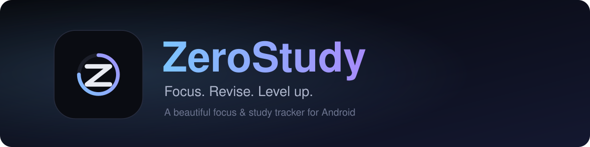

 

&nbsp;

---

## ✨ Overview

**ZeroStudy** is a focus and study tracker for Android that brings your timer, subjects, spaced-repetition revisions, goals and stats into one clean, fast app. Everything runs on your device: no account, no ads, no network needed.

## 🚀 Features

### ⏱️ Focus
- 🍅 **Pomodoro timer** with 25/5, 50/10 and 90/15 presets, or a free stopwatch. Fine-tune focus and break length with a slider or exact +/- buttons.
- 🎯 **Gradient progress ring** with an ambient particle animation.
- 🕰️ **Full-screen flip clock** with big animated digits while you study.
- 🔔 **Runs in the background.** A live notification with Pause / Resume keeps the countdown going when the app is closed.
- ⏰ **Exact alarms.** The end-of-session sound and vibration fire on time, even with a locked phone or in silent mode.
- 🏝️ **Hyper Island support** (Xiaomi / HyperOS) shows the timer around the camera cutout.
- 🌧️ **Ambient sound.** Rain or Lo-fi plays only while you focus, loops seamlessly and works offline.
- 🔊 **12 loud alert sounds.** Short 1-2 second alerts, preview each one and pick your favourite.

### 📚 Study
- 📖 **Subjects & chapters** with completion tracking, difficulty tags (Easy / Medium / Hard) and notes.
- 🔁 **Spaced-repetition revisions** on a schedule you control (default 1, 3, 7, 15, 30 days). *Done* pushes the next revision out, *Forgot* restarts the cycle.
- 🗂️ **Revisions tab** shows your whole plan grouped by date, subject and chapter, with a daily revision limit so work never piles up.
- ✅ **Today's plan.** A daily checklist with optional subject tags, carried-over tasks and due revisions in one place.
- 🎓 **Exam countdown** with multiple exams and the nearest one on your home screen.

### 📊 Progress
- 📈 **Stats** with daily, weekly and monthly charts, subject comparison and today's sessions.
- 🟩 **22-week heatmap**, best day / best week records and streaks.
- 🏆 **Goals** with daily and weekly study targets and live progress.
- ⭐ **XP & levels.** Earn XP for focus minutes, chapters and revisions, with a level-up animation.

### ⚙️ App
- 💾 **Backup & restore.** Export all your data to a file and import it on a new phone.
- 🔄 **Built-in update checker.** Checks this page's releases from Settings and quietly on app open.
- 🌗 **Dark & light themes.**

## 📲 Download & Install

1. Open the [**latest release**](https://github.com/devfahim00/ZeroStudy/releases/latest) and download the `ZeroStudy-vX.Y.Z.apk` file.
2. Open the APK on your phone. If Android asks, allow **Install unknown apps** for your browser or file manager.
3. Tap **Install**, then open **ZeroStudy**.
4. On Android 13 and newer, allow notifications so the timer shows in the notification shade.

> The APK is signed with the same release key for every version, so new versions install straight over the old one and keep your data.

### Updating
Go to **Settings → Check for update** inside the app. It also checks silently each time you open the app and offers the new APK when one is available. You can always grab any version from the [Releases page](https://github.com/devfahim00/ZeroStudy/releases).

## 🧭 How to use

| Step | What to do |
| :-: | :-- |
| **1** | Open the **Subjects** tab and add your subjects and chapters. |
| **2** | On **Home**, pick a subject and chapter, choose a preset (or stopwatch) and press play. |
| **3** | Mark a chapter complete when you finish it. It is scheduled for revision automatically. |
| **4** | Each day, open **Plan** or **Revisions** to see what is due and tap **Done** or **Forgot**. |
| **5** | Set daily and weekly goals and add your exams to stay on track. |
| **6** | Watch your streak, heatmap, XP and level grow in **Stats**. |

**Xiaomi / HyperOS:** open **Settings → Hyper Island** once and allow *Focus / Island notifications* for ZeroStudy to see the timer in the island.

## 📋 Requirements

- Android **8.0 (API 26)** or newer
- About 15 MB of free storage

## 🔒 Privacy

All of your data is stored locally on your device. ZeroStudy has no account system and does not collect or upload anything. The only network request is the optional update check against this repository's releases.

## 🛠️ Built with

Kotlin · Jetpack Compose (Material 3) · custom Canvas animations · foreground service & exact alarms

## 📝 Changelog

See [**CHANGELOG.md**](CHANGELOG.md) for what changed in every version.

## 💬 Community & Support

- Join the community on [**Telegram**](https://t.me/projectredfox)
- Found a bug or have an idea? Open an [**issue**](https://github.com/devfahim00/ZeroStudy/issues)

## 🙏 Credits

The bundled [Sora](https://fonts.google.com/specimen/Sora) font is licensed under the SIL Open Font License 1.1.

---

Made with ❤️ by [**devfahim00**](https://github.com/devfahim00)

If ZeroStudy helps you, consider giving the repo a ⭐

